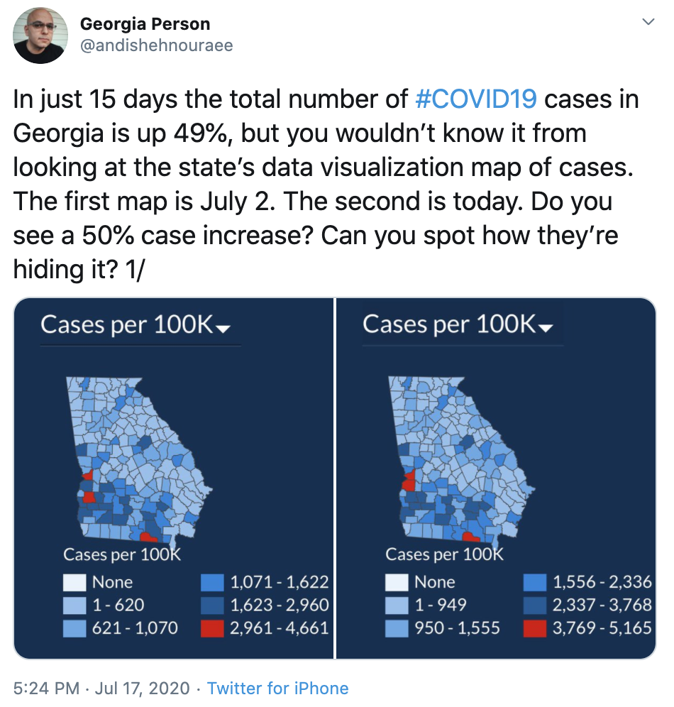

We have already provided some rules to follow as we created plots for our examples. Here we aim to provide some general principles we can use as a guide for effective data visualization. Much of this section is based on a talk by [Karl Broman](http://kbroman.org/) titled ["Creating effective figures and tables"](https://www.biostat.wisc.edu/~kbroman/presentations/graphs2017.pdf) including some of the figures which were made with code that Karl makes available on his [GitHub](https://github.com/kbroman/Talk_Graphs) repository, and class notes from Peter Aldhous' [Introduction to Data Visualization course](http://paldhous.github.io/ucb/2016/dataviz/index.html).

Following Karl's approach, we show some examples of plot styles we should avoid, explain how to improve them, and use these as motivation for a list of principles.We compare and contrast plots that follow these principles to those that don't.

The principles are mostly based on research related to how humans detect patterns and make visual comparisons. The preferred approaches are those that best fit the way our brains process visual information. When deciding on a visualization approach it is also important to keep our goal in mind. We may be comparing a viewable number of quantities, describing a distribution for categories or numeric values, comparing the data from two groups, or describing the relationship between two variables.

As a final note, we also note that for a data scientist it is important to adapt and optimize graphs to the audience. For example, an exploratory plot made for ourselves will be different than a chart intended to communicate a finding to a general audience.

We will be using these libraries:

```{r, warning=FALSE, message=FALSE}
library(tidyverse)
library(gridExtra)
library(dslabs)
ds_theme_set()
```

## Encoding data using visual cues
We start by describing some principles for encoding data. There are several approaches at our disposal including *position*, *aligned lengths*, *angles*, *area*, *brightness*, and *color hue*. 

To illustrate how some of these strategies compare let's suppose we want to report the results from two hypothetical polls regarding browser preference taken in 2000 and then 2015. Here, for each year, we are simply comparing five quantities, five percentages.

A widely used graphical representation of percentages, popularized by Microsoft Excel, is the pie chart:

```{r, echo=FALSE}
browsers <- data.frame(Browser = rep(c("Opera","Safari","Firefox","IE","Chrome"),2),
                       Year = rep(c(2000, 2015), each = 5),
                       Percentage = c(3,21,23,28,26, 2,22,21,27,29)) %>%
  mutate(Browser = reorder(Browser, Percentage))
```

```{r piechart, echo=FALSE}
library(ggthemes)
p1 <- browsers %>% ggplot(aes(x = "", y = Percentage, fill = Browser)) +
  geom_bar(width = 1, stat = "identity", col = "black")  + coord_polar(theta = "y") +
  theme_excel() + xlab("") + ylab("") +
  theme(axis.text=element_blank(), 
        axis.ticks = element_blank(), 
        panel.grid  = element_blank()) +
  facet_grid(.~Year)
p1
```

Here we are representing quantities with both areas and angles since both the angle and area of each pie slice is proportional to the quantity it represents. This turns out to be a suboptimal choice since, as demonstrated by perception studies, *humans are not good at precisely quantifying angles and are even worse when only area is available*.

The donut chart is an example of a plot that uses only area: 

```{r donutchart, echo=FALSE}
browsers %>% ggplot(aes(x = 2, y = Percentage, fill = Browser)) +
  geom_bar(width = 1, stat = "identity", col = "black")  + 
  scale_x_continuous(limits=c(0.5,2.5)) + coord_polar(theta = "y") +
  theme_excel() + xlab("") + ylab("") +
  theme(axis.text=element_blank(), 
        axis.ticks = element_blank(), 
        panel.grid  = element_blank()) +
  facet_grid(.~Year)

```

To see how hard it is to quantify angles, note that the rankings and all the percentages in the plots above changed from 2000 to 2015. Can you determine the actual percentages and rank the browsers' popularity? Can you see how the percentages changed from 2000 to 2015? It is not easy to tell from the plot.

In fact, the `pie` R function help file states:

> "Note: Pie charts are a very bad way of displaying information. The eye is good at judging linear measures and bad at judging relative areas. A bar chart or dot chart is a preferable way of displaying this type of data."

In this case, simply showing the numbers is not only clearer, but it would save on print cost if making a paper version. 

```{r, echo=FALSE}
browsers %>% spread(Year, Percentage) %>% knitr::kable()
```

The preferred way to plot quantities is to use *length* and *position* since humans are much better at judging *linear measure*. The bar plot uses bars of length proportional to the quantities of interest. By adding horizontal lines at strategically chosen values, in this case at every multiple of 10, we ease the quantifying through the position of the top of the bars.


```{r barplot, fig.height = 5}
p2 <-browsers %>%
  ggplot(aes(Browser, Percentage)) + 
  geom_bar(stat = "identity", width=0.5, fill=4, col = 1) +
  ylab("Percent using the Browser") +
  facet_grid(.~Year)
grid.arrange(p1, p2, nrow = 2)
```

Notice how much easier it is to see the differences in the barplot. In fact, we can now determine the actual percentages by following a horizontal line to the x-axis. 

If for some reason you need to make a pie chart, do include the percentages as numbers to avoid having to infer them from the angles or area: 

```{r, eaco = FALSE, warning = FALSE, message=FALSE, echo=FALSE}
library(scales)
browsers <- filter(browsers, Year == 2015)
at <- with(browsers, 100 - cumsum(c(0,Percentage[-length(Percentage)])) - 0.5*Percentage)  
label <- percent(browsers$Percentage/100)
browsers %>% ggplot(aes(x = "", y = Percentage, fill = Browser)) +
  geom_bar(width = 1, stat = "identity", col = "black")  + coord_polar(theta = "y") +
  theme_excel() + xlab("") + ylab("") + ggtitle("2015") +
  theme(axis.text=element_blank(), 
        axis.ticks = element_blank(), 
        panel.grid  = element_blank()) +
annotate(geom = "text", 
              x = 1.62, 
              y =  at, 
              label = label, size=4)
```

In general, position and length are the preferred ways to display quantities over angles which are preferred to area.

Brightness and color are even harder to quantify than angles and area but, as we will see later, they are sometimes useful when more than two dimensions are being displayed.

### Know when to include 0

When using barplots it is dishonest not to start the bars at 0. This is because, by using a barplot, we are implying the length is proportional to the quantities being displayed. By avoiding 0, relatively small differences can be made to look much bigger than they actually are. This approach is often used by politicians or media organizations trying to exaggerate a difference.

Here is an illustrative example:


(Source: Fox News, via [Peter Aldhous](http://paldhous.github.io/ucb/2016/dataviz/week2.html) via Media Matters via Fox News) via [Media Matters](http://mediamatters.org/blog/2013/04/05/fox-news-newest-dishonest-chart-immigration-enf/193507). 

From the plot above, it appears that apprehensions have almost tripled when in fact they have only increased by about 16%. Starting the graph at 0 illustrates this clearly: 

```{r, echo=FALSE}
data.frame(Year = as.character(c(2011, 2012, 2013)),Southwest_Border_Apprehensions = c(165244,170223,192298)) %>%
  ggplot(aes(Year, Southwest_Border_Apprehensions )) +
  geom_bar(stat = "identity", fill = "yellow", col = "black", width = 0.65) 
```

Here is another example, described in detail [here](http://flowingdata.com/2012/08/06/fox-news-continues-charting-excellence/), which makes a 4.6% increase look like a five fold change.


Here is the appropriate plot: 

```{r, echo=FALSE, fig.height=4}
data.frame(date = c("Now", "Jan 1, 2013"), tax_rate = c(35, 39.6)) %>%
  mutate(date = reorder(date, tax_rate)) %>%
  ggplot(aes(date, tax_rate)) + ylab("") + xlab("") +
  geom_bar(stat = "identity", fill = "yellow", col = "black", width = 0.5) + 
  ggtitle("Top Tax Rate If Bush Tax Cut Expires")
```

When using position rather than length, it is **not** necessary to include 0. This is particularly the case when we want to compare differences between groups relative to the variability seen within the groups.

Here is an illustrative example showing country average life expectancy stratified by continent in 2012: 

```{r, echo=FALSE, fig.height=4, fig.width=6}
p1 <- gapminder %>% filter(year == 2012) %>%
  ggplot(aes(continent, life_expectancy)) +
  geom_point()
p2 <- p1 +
  scale_y_continuous(limits = c(0, 84))
grid.arrange(p2, p1, ncol = 2)
```

The space between 0 and 43 in the plot on the left adds no information and makes it harder to appreciate the between and within variability. Here, 0 should not be included.

### Do not distort quantities

During President Barack Obama’s 2011 State of the Union Address the following chart was used to compare the US GDP to the GDP of four competing nations:


Note judging by the area of the circles the US appears to have an economy over five times larger than China and over 30 times larger than France. However, when looking at the actual numbers one sees that this is not the case. The actual ratios are 2.6 and 5.8 times bigger than China and France respectively. The reason for this distortion is that the radius, rather than the area, was made to be proportional to the quantity which implies that the proportion between the areas is squared: 2.6 turns into 6.5 and 5.8 turns into 34.1. Proportional to the radius compared to proportional to area: 

```{r, echo = FALSE, fig.height=4.5}
gdp <- c(14.6, 5.7, 5.3, 3.3, 2.5)
gdp_data <- data.frame(Country = rep(c("United States", "China", "Japan", "Germany", "France"),2),
           y = factor(rep(c("Radius","Area"),each=5), levels = c("Radius", "Area")),
           GDP= c(gdp^2/min(gdp^2), gdp/min(gdp))) %>% 
   mutate(Country = reorder(Country, GDP))
gdp_data %>% 
  ggplot(aes(Country, y, size = GDP)) + 
  geom_point(show.legend = FALSE, color = "blue") + 
  scale_size(range = c(2,30)) +
  coord_flip() + ylab("") + xlab("")
```

Not surprisingly, ggplot defaults to using area rather than radius. Of course, in this case, we really should not be using area at all since we can use position and length: 

```{r, echo=FALSE}
gdp_data %>% filter(y == "Area") %>% ggplot(aes(Country, GDP)) + geom_bar(stat = "identity") + ylab("GDP in trillions of US dollars")
```

### Order by a meaningful value

When one of the axes is used to show categories, as is done in barplots, the default ggplot behavior is to order the categories alphabetically when they are defined by character strings. If they are defined by factors, they are ordered by the factor levels. We rarely want to use alphabetical order. Instead we should order by a meaningful quantity.

In all the cases above, the barplots where ordered by the values being displayed. The exception was the graph showing barplots comparing browsers. In this case we kept the order the same across the barplots to ease the comparison. We ordered by the average value of 2000 and 2015. We previously learned how to use the `reorder` function, which helps achieve this goal.

To appreciate how the right order can help convey a message, suppose we want to create a plot to compare the murder rate across states. We are particularly interested in the most dangerous and safest states. Note the difference when we order alphabetically (the default) versus when we order by the actual rate: 

```{r, eval=FALSE}
data(murders)
p1 <- murders %>% mutate(murder_rate = total / population * 100000) %>%
  ggplot(aes(state, murder_rate)) +
  geom_bar(stat="identity") +
  coord_flip() +
  xlab("")

p2 <- murders %>% mutate(murder_rate = total / population * 100000) %>%
  mutate(state = reorder(state, murder_rate)) %>%
  ggplot(aes(state, murder_rate)) +
  geom_bar(stat="identity") +
  coord_flip() +
  xlab("")
grid.arrange(p1, p2, ncol = 2)
```

```{r, echo=FALSE}
data(murders)
p1 <- murders %>% mutate(murder_rate = total / population * 100000) %>%
  ggplot(aes(state, murder_rate)) +
  geom_bar(stat="identity") +
  coord_flip() +
  xlab("")

p2 <- murders %>% mutate(murder_rate = total / population * 100000) %>%
  mutate(state = reorder(state, murder_rate)) %>%
  ggplot(aes(state, murder_rate)) +
  geom_bar(stat="identity") +
  coord_flip() +
  xlab("")
grid.arrange(p1, p2, ncol = 2)
```

Note that the `reorder` function lets us reorder groups as well. 

Below is an example we saw earlier with and without reorder. The first orders the regions alphabetically while the second orders them by the group's median.

```{r, echo=FALSE, fig.width = 8}
past_year <- 1970
p1 <- gapminder %>% 
  mutate(dollars_per_day = gdp/population/365) %>%
  filter(year == past_year & !is.na(gdp)) %>%
  ggplot(aes(region, dollars_per_day, fill = continent)) +
  geom_boxplot() +
  theme(axis.text.x = element_text(angle = 90, hjust = 1)) +
  xlab("")
p2 <- gapminder %>% 
  mutate(dollars_per_day = gdp/population/365) %>%
  filter(year == past_year & !is.na(gdp)) %>%
  mutate(region = reorder(region, dollars_per_day, FUN = median)) %>%
  ggplot(aes(region, dollars_per_day, fill = continent)) +
  geom_boxplot() +
  theme(axis.text.x = element_text(angle = 90, hjust = 1)) +
  xlab("")
grid.arrange(p1, p2, ncol=2)
```


### Show the data

We have focused on displaying single quantities across categories. We now shift our attention to displaying data, with a focus on comparing groups. 

To motivate our first principle, we'll use our heights data. A commonly seen plot used for comparisons between groups, popularized by software such as Microsoft Excel, shows the average and standard errors (standard errors are defined in a later lecture, but don't confuse them with the standard deviation of the data).

The plot looks like this: 

```{r, echo=FALSE, fig.height=4.5, message=FALSE}
data(heights)
p1 <- heights %>% group_by(sex) %>% summarize(average = mean(height), se=sd(height)/sqrt(n())) %>%
  ggplot(aes(sex, average)) + theme_excel() + 
  geom_errorbar(aes(ymin = average - 2*se, ymax = average+2*se), width = 0.25)+
  geom_bar(stat = "identity", width=0.5, fill=4, col = 1) +
  ylab("Height in inches")
p1
```

The average of each group is represented by the top of each bar and the antennae expand to the average plus two standard errors. If all someone receives is this plot they will have little information on what to expect if they meet a group of human males and females. The bars go to 0, does this mean there are tiny humans measuring less than one foot? Are all males taller than the tallest females? Is there a range of heights? Someone can't answer these questions since we have provided almost no information on the height distribution.

This brings us to our first principle: **show the data**. This simple ggplot code already generates a more informative plot than the barplot by simply showing all the data points: 

```{r,fig.height=4.5}
heights %>% ggplot(aes(sex, height)) + geom_point() 
```

For example, we get an idea of the range of the data. However, this plot has limitations as well since we can't really see all the `r sum(heights$sex=="Female")` and `r sum(heights$sex=="Male")` points plotted for females and males respectively, and many points are plotted on top of each other. As we have described, visualizing the distribution is much more informative. But before doing this, we point out two ways we can improve a plot showing all the points.

The first is to add **jitter**: adding a small random shift to each point. In this case, adding horizontal jitter does not alter the interpretation, since the height of the points do not change, but we minimize the number of points that fall on top of each other and therefore get a better sense of how the data is distributed.

A second improvement comes from using **alpha blending**: making the points somewhat transparent. The more points fall on top of each other, the darker the plot which also helps us get a sense of how the points are distributed.

Here is the same plot with jitter and alpha blending: 

```{r, fig.height=4.5}
heights %>% ggplot(aes(sex, height)) + 
  geom_jitter(width = 0.1, alpha = 0.2) 
```

Now we start getting a sense that, on average, males are taller than females. We also note dark horizontal lines demonstrating that many reported values are rounded to the nearest integer. Since there are so many points it is more effective to show distributions, rather than show individual points. In our next example we show the improvements provided by distributions and suggest further principles.

### Ease comparisons: Use common axes
Earlier we saw this plot used to compare male and female heights:

```{r, echo=FALSE, fig.height=4.5}
data(heights)
p1 <- heights %>% group_by(sex) %>% summarize(average = mean(height), se=sd(height)/sqrt(n())) %>%
  ggplot(aes(sex, average)) + theme_excel() + 
  geom_errorbar(aes(ymin = average - 2*se, ymax = average+2*se), width = 0.25)+
  geom_bar(stat = "identity", width=0.5, fill=4, col = 1) +
  ylab("Height in inches")
p1
```

Since there are so many points it is more effective to show distributions, rather than show individual points.
We therefore show histograms for each group: 

```{r, echo=FALSE, fig.height=4.5}
heights %>% 
  ggplot(aes(height, ..density..)) +
  geom_histogram(binwidth = 1, color="black") +
  facet_grid(.~sex, scales = "free_x")
```

However, from this plot it is not immediately obvious that males are, on average, taller than females. We have to look carefully to notice that the x-axis has a higher range of values in the male histogram. An important principle here is to **keep the axes the same** when comparing data across to plots.

Note how the comparison becomes easier: 

```{r, echo=FALSE, fig.height=4.5}
heights %>% 
  ggplot(aes(height, ..density..)) +
  geom_histogram(binwidth = 1, color="black") +
  facet_grid(.~sex)
```

*Align plots vertically to see horizontal changes and horizontally to see vertical changes*. In these histograms, the visual cue related to decreases or increases in height are shifts to the left or right respectively: horizontal changes. Aligning the plots vertically helps us see this change when the axis are fixed: 

```{r, echo=FALSE, fig.height=4.5}
p2 <- heights %>% 
  ggplot(aes(height, ..density..)) +
  geom_histogram(binwidth = 1, color="black") +
  facet_grid(sex~.)
p2
```

This plot makes it much easier to notice that men are, on average, taller. If instead of histograms we want the more compact summary provided by boxplots, then we align them horizontally, since, by default, boxplots move up and down with changes in height.

Following our _show the data_ principle we overlay all the data points:  

```{r,echo=FALSE, fig.height=4.5}
p3 <- heights %>% 
  ggplot(aes(sex, height)) + 
  geom_boxplot(coef=3) + 
  geom_jitter(width = 0.1, alpha = 0.2) +
  ylab("Height in inches")
p3
```

Now contrast and compare these three plots, based on exactly the same data:

```{r, fig.width=7, fig.height=4, echo=FALSE}
grid.arrange(p1, p2, p3, ncol = 3)
```

Note how much more we learn from the two plots on the right. Barplots are useful for showing one number, but not very useful when wanting to describe distributions.

### Consider transformations

We have motivated the use the log transformation in cases where the changes are multiplicative. Population size was an example in which we found a log transformation to yield a more informative transformation. The combination of incorrectly using barplots when a log transformation is merited can be particularly distorting.

As an example, consider this barplot showing the average population sizes for each continent in 2015:

```{r, echo=FALSE, fig.height=4.5, message=FALSE}
data(gapminder)
p1 <- gapminder %>% filter(year == 2015) %>%
  group_by(continent) %>% summarize(population = mean(population)) %>%
  mutate(continent = reorder(continent, population)) %>%
  ggplot(aes(continent, population/10^6)) + 
  geom_bar(stat = "identity", width=0.5, fill=4) +
  theme_excel() + 
  ylab("Population in Millions") +
  xlab("Continent")
p1
```

From this plot one would conclude that countries in Asia are much more populous than other continents. Following the _show the data_ principle we quickly notice that this is due to two very large countries, which we assume are India and China: 


```{r ,echo=FALSE}
p2 <- gapminder %>% filter(year == 2015) %>% 
  mutate(continent = reorder(continent, population, median)) %>%
  ggplot(aes(continent, population/10^6)) + 
  ylab("Population in Millions") +
  xlab("Continent")
p2 +  geom_jitter(width = .1, alpha = .5) 
```

Here, using a log transformation provides a much more informative plot. We compare the original barplot to a boxplot using the log scale transformation for the y-axis:


```{r, echo=FALSE, fig.width=7, fig.height=4.5}
p2 <- p2 + geom_boxplot(coef=3) + 
   geom_jitter(width = .1, alpha = .5) + scale_y_log10(breaks = c(1,10,100,1000))
grid.arrange(p1, p2, ncol = 2)
```

Note in particular that with the new plot we realize that countries in Africa actually have a larger median population size than those in Asia.

Other transformations you should consider are the logistic transformation, useful to better see fold changes in odds, and the square root transformation, useful for count data.

### Adjacent visual cues

When comparing income data between 1970 and 2010 across region we made a figure similar to the one below. A difference is that here we look at continents instead of regions, but this is not relevant to the point we are making. 


```{r, echo=FALSE}
gapminder %>% 
  filter(year %in% c(1970, 2010) & !is.na(gdp)) %>%
  mutate(dollars_per_day = gdp/population/365) %>%
  mutate(labels = paste(year, continent)) %>%
  ggplot(aes(labels, dollars_per_day)) +
  geom_boxplot() + 
  theme(axis.text.x = element_text(angle = 90, hjust = 1)) +
  scale_y_continuous(trans = "log2") + 
  ylab("Income in dollars per day")
```

Note that, for each continent, we want to compare the distributions from 1970 to 2010. The default in ggplot is to order alphabetically so the labels with 1970 come before the labels with 2010, making the comparisons challenging.

Comparison is even easier when boxplots are next to each other: 

```{r, echo=FALSE}
gapminder %>% 
  filter(year %in% c(1970, 2010) & !is.na(gdp)) %>%
  mutate(dollars_per_day = gdp/population/365) %>%
  mutate(labels = paste(continent, year)) %>%
  ggplot(aes(labels, dollars_per_day)) +
  geom_boxplot() + 
  theme(axis.text.x = element_text(angle = 90, hjust = 1)) +
  scale_y_continuous(trans = "log2") + 
  ylab("Income in dollars per day")
```

### Ease comparison: use color

Comparison is easier when color is used to denote the two things compared. 

```{r,echo=FALSE}
 gapminder %>% 
  filter(year %in% c(1970, 2010) & !is.na(gdp)) %>%
  mutate(dollars_per_day = gdp/population/365, year = factor(year)) %>%
  ggplot(aes(continent, dollars_per_day, fill = year)) +
  geom_boxplot() + 
  theme(axis.text.x = element_text(angle = 90, hjust = 1)) +
  scale_y_continuous(trans = "log2") + 
  ylab("Income in dollars per day")
```

### Think of the color blind

About 10% of the population is color blind. Unfortunately, the default colors used in ggplot are not optimal for this group. However, ggplot does make it easy to change the color palette used in plots. Here is an example of how we can use a [color blind friendly pallet](http://www.cookbook-r.com/Graphs/Colors_(ggplot2)/#a-colorblind-friendly-palette). There are several resources that help you select colors, for example [this one](http://bconnelly.net/2013/10/creating-colorblind-friendly-figures/). 


```{r, fig.height=3.5}
color_blind_friendly_cols <- c("#999999", "#E69F00", "#56B4E9", 
                               "#009E73", "#F0E442", "#0072B2", 
                               "#D55E00", "#CC79A7")
p1 <- data.frame(x=1:8, y=1:8, col = as.character(1:8)) %>% 
  ggplot(aes(x, y, color = col)) + geom_point(size=5)
p1 + scale_color_manual(values=color_blind_friendly_cols)
```


### Scatter plots

Use scatter plots to examine the relationship between two continuous variables. In every single instance in which we have examined the relationship between two continuous variables, total murders versus population size, life expectancy versus fertility rates, and child mortality versus income, we have used scatter plots. This is the plot we generally recommend. 

### Slope charts

One exception where another type of plot may be more informative is when you are comparing variables of the same type but at different time points and for a relatively small number of comparisons. For example, comparing life expectancy between 2010 and 2015. In this case we might recommend a **slope chart**. There is not a geometry for slope chart in ggplot2 but we can construct one using `geom_lines`. We need to do some tinkering to add labels.

Here is a comparison for large western countries: 

```{r,eval=FALSE}
west <- c("Western Europe","Northern Europe","Southern Europe",
          "Northern America","Australia and New Zealand")
dat <- gapminder %>% 
  filter(year%in% c(2010, 2015) & region %in% west & 
           !is.na(life_expectancy) & population > 10^7) 
dat %>%
  mutate(location = ifelse(year == 2010, 1, 2), 
         location = ifelse(year == 2015 & 
         country%in%c("United Kingdom","Portugal"), 
         location+0.22, location),
         hjust = ifelse(year == 2010, 1, 0)) %>%
  mutate(year = as.factor(year)) %>%
  ggplot(aes(year, life_expectancy, group = country)) +
  geom_line(aes(color = country), show.legend = FALSE) +
  geom_text(aes(x = location, label = country, hjust = hjust), 
            show.legend = FALSE) +
  xlab("") + ylab("Life Expectancy")
```


```{r,echo=FALSE}
west <- c("Western Europe","Northern Europe","Southern Europe",
          "Northern America","Australia and New Zealand")
dat <- gapminder %>% 
  filter(year%in% c(2010, 2015) & region %in% west & 
           !is.na(life_expectancy) & population > 10^7) 
dat %>%
  mutate(location = ifelse(year == 2010, 1, 2), 
         location = ifelse(year == 2015 & 
         country%in%c("United Kingdom","Portugal"), 
         location+0.22, location),
         hjust = ifelse(year == 2010, 1, 0)) %>%
  mutate(year = as.factor(year)) %>%
  ggplot(aes(year, life_expectancy, group = country)) +
  geom_line(aes(color = country), show.legend = FALSE) +
  geom_text(aes(x = location, label = country, hjust = hjust), 
            show.legend = FALSE) +
  xlab("") + ylab("Life Expectancy")
```

An advantage of the slope chart is that it permits us to quickly get an idea of changes based on the slope of the lines. Note that we are using **angle** as the visual cue. But we also have position to determine the exact values. Comparing the improvements is a bit harder with a scatter plot:

```{r, echo=FALSE}
library(ggrepel)
west <- c("Western Europe","Northern Europe","Southern Europe",
          "Northern America","Australia and New Zealand")

dat <- gapminder %>% 
  filter(year%in% c(2010, 2015) & region %in% west & 
           !is.na(life_expectancy) & population > 10^7) 

dat %>% 
   mutate(year = paste0("life_expectancy_", year)) %>%
   select(country, year, life_expectancy) %>% spread(year, life_expectancy) %>% 
   ggplot(aes(x=life_expectancy_2010,y=life_expectancy_2015, label = country)) + geom_point() + geom_text_repel() +
  scale_x_continuous(limits=c(78.5, 83)) +
  scale_y_continuous(limits=c(78.5, 83)) +
  geom_abline(lty = 2) +
  xlab("2010") + ylab("2015")
```

### Use common charts

Note that in the scatter plot we have followed the principle _use common axes_ since we are comparing these before and after. However, if we have many points the slope charts stop being useful as it becomes hard to see each line.

### Bland-Altman plot

Since we are interested in the difference, it makes sense to dedicate one of our axes to it. The Bland-Altman plot, also known as the Tukey mean-difference plot and the MA-plot, shows the difference versus the average: 

```{r, echo=FALSE}
library(ggrepel)
dat %>% 
   mutate(year = paste0("life_expectancy_", year)) %>%
   select(country, year, life_expectancy) %>% spread(year, life_expectancy) %>% 
  mutate(average = (life_expectancy_2015 + life_expectancy_2010)/2,
         difference = life_expectancy_2015 - life_expectancy_2010) %>%
  ggplot(aes(average, difference, label = country)) + 
  geom_point() +
  geom_text_repel() +
  geom_abline(lty = 2) +
  xlab("Average of 2010 and 2015") + ylab("Difference between 2015 and 2010")
```

Here we quicky see which countries have improved the most as it is represented by the y-axis. We also get an idea of the overall value from the x-axis.

### Encoding a third variable

We previously showed a scatter plot showing the relationship between infant survival and average income. Here is a version of this plot where we encode three variables: OPEC membership, region, and population: 

```{r, echo=FALSE}
present_year <- 2010

dat <- gapminder %>%
  mutate(region = case_when(
    region %in% west ~ "The West",
    region %in% "Northern Africa" ~ "Northern Africa",
    region %in% c("Eastern Asia", "South-Eastern Asia") ~ "East Asia",
    region == "Southern Asia"~ "Southern Asia",
    region %in% c("Central America", "South America", "Caribbean") ~ "Latin America",
    continent == "Africa" & .$region != "Northern Africa" ~ "Sub-Saharan Africa",
    region %in% c("Melanesia", "Micronesia", "Polynesia") ~ "Pacific Islands"),
    dollars_per_day = gdp / population / 365) %>%
  filter(year %in% present_year & !is.na(gdp) & !is.na(infant_mortality) & !is.na(region) ) %>%
  mutate(OPEC = ifelse(country %in% opec, "Yes", "No")) 

dat %>% 
  ggplot(aes(dollars_per_day, 1 - infant_mortality/1000, 
             col = region, size = population/10^6,
             shape =  OPEC)) +
  scale_x_continuous(trans = "log2", limits=c(0.25, 150)) +
  scale_y_continuous(trans = "logit",limit=c(0.875, .9981),
                     breaks=c(.85,.90,.95,.99,.995,.998)) + 
  geom_point(alpha = 0.5) 

```


Note that we encode categorical variables with color, hue, and shape. The shape can be controlled with the `shape` argument. Below are the shapes available for use in R. Note that for the last five, the color goes inside. 


```{r, echo=FALSE}
dat2=data.frame(x=c(0:25))
ggplot() +
  theme_minimal() +
  theme(axis.title.x=element_blank(),
        axis.text.x=element_blank(),
        axis.ticks.x=element_blank(),
        axis.title.y=element_blank(),
        axis.text.y=element_blank(),
        axis.ticks.y=element_blank(),
        panel.grid.major = element_blank(), 
        panel.grid.minor = element_blank()) +
scale_shape_identity() + scale_y_reverse() +
geom_point(dat2, mapping=aes(x%%9, x%/%9, shape=x), size=10, fill="blue") +
geom_text(dat2, mapping=aes(x%%9, x%/%9+0.25, label=x), size=6) 
```

The default shape values are a circle and a triangle for OPEC membership. We can manually customize these by adding the layer `scale_shape_manual(values = c(8, 10))`, where 8 and 10 are the numbers of the desired shapes from the list above.

```{r}
dat %>% 
  ggplot(aes(dollars_per_day, 1 - infant_mortality/1000, 
             col = region, size = population/10^6,
             shape =  OPEC)) +
  scale_x_continuous(trans = "log2", limits=c(0.25, 150)) +
  scale_y_continuous(trans = "logit",limit=c(0.875, .9981),
                     breaks=c(.85,.90,.95,.99,.995,.998)) + 
  geom_point(alpha = 0.5) +
  scale_shape_manual(values = c(8, 10))
```

For continuous variables we can use color, intensity or size. We now show an example of how we do this with a case study.

## Case Study: Vaccines 

Vaccines have helped save millions of lives. In the 19th century, before herd immunization was achieved through vaccination programs, deaths from infectious diseases, like smallpox and polio, were common. However, today, despite all the scientific evidence for their importance, vaccination programs have become somewhat controversial.

```{r}
library(dslabs)
data(us_contagious_diseases)
str(us_contagious_diseases)
```

We create a temporary object `dat` that stores only the Measles data, includes a per 100,000 rate, orders states by average value of disease and removes Alaska and Hawaii since they only became states in the late 1950s. 

```{r}
the_disease <- "Measles"
dat <- us_contagious_diseases %>%
       filter(!state %in% c("Hawaii","Alaska") & disease == the_disease) %>%
       mutate(rate = (count / weeks_reporting) * 52 / (population / 100000)) 
```


Can we show data for all states in one plot? We have three variables to show: year, state and rate. 

When choosing colors to quantify a numeric variable we chose between two options: *sequential* and *diverging*. Sequential colors are suited for data that goes from high to low. High values are clearly distinguished from low values. Here are some examples offered by the package `RColorBrewer`:

```{r}
library(RColorBrewer)
display.brewer.all(type = "seq")
```

Diverging colors are used to represent values that diverge from a center. We put equal emphasis on both ends of the data range: higher than the center and lower than the center. An example of when we would use a divergent pattern would be if we were to show height in standard deviations away from the average. Here are some examples of divergent patterns: 

```{r}
library(RColorBrewer)
display.brewer.all(type="div")
```

In our example we want to use a sequential palette since there is no meaningful center, just low and high rates.

### geom tile
We use the geometry `geom_tile` to tile the region with colors representing disease rates. We use a square root transformation to avoid having the really high counts dominate the plot. 

```{r}
dat %>% ggplot(aes(year, state,  fill = rate)) +
        geom_tile(color = "grey50") +
        scale_x_continuous(expand = c(0,0)) +
        scale_fill_gradientn(colors = brewer.pal(9, "Reds"), trans = "sqrt") +
        geom_vline(xintercept = 1963, col = "blue") +
        theme_minimal() +  theme(panel.grid = element_blank()) +
        ggtitle(the_disease) + 
        ylab("") + 
        xlab("")
```

This plot makes a very striking argument for the contribution of vaccines. However, one limitation of this plot is that it uses color to represent quantity which we earlier explained makes it a bit harder to know exactly how high it is going. Position and length are better cues. If we are willing to lose state information, we can make a version of the plot that shows the values with position.

### Avoid pseudo 3D plots

The figure below, taken from the scientific literature [CITE: DNA Fingerprinting: A Review of the Controversy Kathryn Roeder Statistical Science Vol. 9, No. 2 (May, 1994), pp. 222-247] shows three variables: dose, drug type and survival. Although your screen is flat and two dimensional, the plot tries to imitate three dimensions and assigns a dimension to each variable. The extra dimension is not only unnecessary, it makes what should be an easy plot to decipher nearly impossible to draw conclusions from.


# Maps

```{r setup, include=FALSE}
knitr::opts_chunk$set(echo = TRUE, message = FALSE, warning = FALSE)
```

```{r, echo = FALSE, message=FALSE, warning=FALSE}
library(usmap)
library(ggplot2)
library(readr)
library(lubridate)
library(maps)
library(dplyr)
library(dslabs)
library(stringr)
```

Plots of maps can be very powerful, very informative and very aesthetically pleasing visualizations. However, they can also be misleading if not created correctly. Here we will introduce one R package for creating effective and informative maps and show how to correct a misleading set of maps. 

There are several R packages available that can be used to create plots of maps. We will be focusing on one of the packages,  `maps`, because of how intuitive it is, the data available, and because it works well with `ggplot2`. We will see several of the options available with this package, but you can read more about the `maps` package [here](https://cran.r-project.org/web/packages/maps/maps.pdf) and see more examples [here](https://eriqande.github.io/rep-res-web/lectures/making-maps-with-R.html). Other available R packages include `usmap`, `ggmap`, `ggspatial`, `sf`, `urbnmapr` and `rnaturalearth`, and we recommend exploring the examples (like [this one](https://ggplot2-book.org/maps.html)) and documentation for these packages for additional types of map plots.


### World Map

The `maps` package contains a lot of outlines of continents, countries, states, and counties. In order to map these using `ggplot2`, we must specify which type of map we want with `map_data()`. ggplot2 provides the `map_data()` as a function that turns a series of points along an outline (from the `maps` package) into a data frame of those points. Below we will see maps of the world, a few countries, the entire US, US states and US counties, but there are more options available with this package. 

We can save map data as a data frame to see what data is available and then map with `ggplot`. Let's look at the "world" option.

```{r}
# Pull out world map data frame
world_map <- map_data("world")
dim(world_map)
head(world_map)
```

We can see the latitude (`lat`) and longitude (`long`) for different regions of the world are available. Here, `region` corresponds to a country and `subregion` indicates additional information about that country if available. For example, the Virgin Islands fall into different political jurisdictions, so you'll see "British" and "US" under `subregion` for the Virgin Islands.  

The column `order` shows in which order ggplot should "connect the dots" when plotting. `group` is important since functions in `ggplot2` can take a group argument which controls (amongst other things) whether adjacent points should be connected by lines. If they are in the same group, then they get connected, but if they are in different groups then they don’t. Essentially, having two points in different groups means that ggplot “lifts the pen” when going between them. As we'll see below, including `group = group` in the `aes()` argument will plot the outlines of countries. If we don't include `group = group`, the plot will have many lines connecting different parts of different countries and will be impossible to interpret.

For this plot we also use `fill` (to denote the color to fill the countries with) and `color` (the outline color for each country). We will see more options as we create more complex maps. 

```{r}
# Basic example of a world map
world_map %>% ggplot(aes(x = long, y = lat, group = group)) +
              geom_polygon(fill = "gray", color = "white")
```

We can also map one specific country, or a few countries. If plotting one country, the second argument of `map_data` should include the name of the country. Note that the name of the country can be typed using all lowercase or with the first letter capitalized. We also introduce `coord_fixed` to make plots even better looking. This fixes the relationship between one unit in the y direction and one unit in the x direction. Then, even if you change the outer dimensions of the plot (i.e. by changing the window size or the size of the pdf file you are saving it to for example), the aspect ratio remains unchanged.

```{r}
india_map <- map_data("world", "India")

india_map %>% ggplot(aes(x = long, y = lat, group = group)) +
              geom_polygon(fill = "cyan4", color = "white") + 
              coord_fixed(1.2) 
```


If we want to plot more than one country, we need to supply a string of country names as the second argument. Here we introduce `theme_set(theme_bw())`. As we've seen before, the default background color for `ggplot2` is a light gray with white grid lines. If you would prefer a different color background you can use different themes. `theme_set(theme_bw())` makes the background color white and the grid lines light gray. This just has to do with preference.    

```{r}
theme_set(theme_bw())
multiple_countries_map <- map_data("world", c("Japan", "Ethiopia", "Australia", "Germany"))
multiple_countries_map %>% ggplot(aes(x = long, y = lat, group = group)) +
                           geom_polygon(fill = "darkred", color = "white") + 
                           coord_fixed(1.3)
```

If you want to remove the longitude and latitude axes as well as the grid lines, you can use the `theme` layer and add the following code to the plot. Since we set a theme for all plots above using `theme_set(theme_bw())`, we need to reset the background to the ggplot default using `theme_set(theme_grey())` first.

```{r}
theme_set(theme_grey()) # back to the default background
multiple_countries_map %>% ggplot(aes(x = long, y = lat, group = group)) +
                           geom_polygon(fill = "darkred", color = "white") + 
                           theme(panel.grid.major = element_blank(), 
                                 panel.background = element_blank(),
                                 axis.title = element_blank(), 
                                 axis.text = element_blank(),
                                 axis.ticks = element_blank()) +
                           coord_fixed(1.3)
```

We can also add `fill = region` to the `aes()` function to fill each country with a different color and add a legend. 

```{r}
theme_set(theme_grey()) # back to the default background
multiple_countries_map %>% ggplot(aes(x = long, y = lat, group = group, fill = region)) +
                           geom_polygon(color = "white") + 
                           theme(panel.grid.major = element_blank(), 
                                 panel.background = element_blank(),
                                 axis.title = element_blank(), 
                                 axis.text = element_blank(),
                                 axis.ticks = element_blank()) +
                           coord_fixed(1.3)
```

### US Map
There are multiple ways of plotting the US with the `maps` package. You could use the `world` data and specify `usa` as the country:

```{r}
us_map <- map_data("world", "usa")
us_map %>% ggplot(aes(x = long, y = lat, group = group)) +
           geom_polygon(fill = "blue4", color = "white") + 
           coord_fixed(1.3)
```

But this is quite difficult to see because it includes Guam, a US territory (it's difficult to see but this is the set of white dots on the right side of the plot). A better alternative (assuming you don't want to include territories and just US states) would be to use `world2` data and specify `usa`:

```{r}
better_us_map <- map_data("world2", "USA")
better_us_map %>% ggplot(aes(x = long, y = lat, group = group)) +
                  geom_polygon(fill = "blue4", color = "white") + 
                  coord_fixed(1.3)
```

`world2` centers the plot on the Pacific Ocean, allowing us to  see Hawaii and bigger versions of Alaska and the mainland states (also known as the lower 48 or contiguous 48).

If you don't need to plot Alaska and Hawaii, an even better option is to not use `world` or `world2` and instead use `usa`; the `maps` package provides data specifically for the mainland states of the US. If we use `usa` instead, we get a much better plot of the US (without Alaska and Hawaii). 

We can also experiment with color a bit and have the outline color set to purple and the fill color set to `NA`, which leaves it blank or transparent to the background color.


```{r}
usa <- map_data("usa")
usa %>% ggplot(aes(x = long, y = lat, group = group)) +
        geom_polygon(color = "purple", fill = NA)
```

```{r}
usa %>% ggplot(aes(x = long, y = lat, group = group)) +
        geom_polygon(color = "purple", fill = "black")
```


### US States
If we want to show individual states, we should instead use the `state` option. But we see a problem - a massive legend is made with one color per state. This is a problem because it eats up most of the plot area. We could make the plot bigger to accommodate the legend, but it would still be difficult for someone without much knowledge of the states to figure out which color corresponds to which state. A better option would be to remove the legend and add labels to the states themselves. 

```{r}
us_states <- map_data("state")

us_states %>% ggplot(aes(x = long, y = lat, fill = region, group = group)) + 
              geom_polygon(color = "white") + 
              coord_fixed(1.3) 
```

To remove the legend we add the layer `guides(fill = FALSE)`.

```{r}
us_states %>% ggplot(aes(x = long, y = lat, fill = region, group = group)) + 
              geom_polygon(color = "white") + 
              coord_fixed(1.3) +
              guides(fill = FALSE) # do this to leave off the color legend

```

Adding state labels with the `maps` package is more complex and not worth our time here. If you need to label states, we recommend using the `usmap` package and first reading [this](https://cran.r-project.org/web/packages/usmap/vignettes/mapping.html) post and then [this](https://cran.r-project.org/web/packages/usmap/vignettes/advanced-mapping.html) post. 

### US Counties

Mapping US state counties is also possible using the `maps` package by using `map_data("county")`. Here we choose a red outline and no fill color, but we notice that the county lines are a little thick and make some counties difficult to see. 

```{r}
AllCounty <- map_data("county")
AllCounty %>% ggplot(aes(x = long, y = lat, group = group)) +
              geom_polygon(color = "red", fill = NA)
```

We can change the width of the lines using the `size` argument, making individual counties a bit easier to see.

```{r}
AllCounty %>% ggplot(aes(x = long, y = lat, group = group)) +
              geom_polygon(color = "red", fill = NA, size = .1 )
```


## Case Study: Georgia Counties COVID-19 Cases

Now that we know the basic setup for plotting different kinds of maps, let's create a meaningful map. Specifically, let's create a corrected version of a misleading set of maps. 

On July 17th, 2020 [Andisheh Nouraee](https://twitter.com/andishehnouraee) tweeted about the following screenshots on Twitter, calling out Georgia's Department of Public Health for hiding the severity of the COVID-19 outbreak in Georgia with its map visualizations. 

{ width=50% }

Nouraee had been taking daily screenshots and noticed that the legend numbers kept changing. With changing legend number cutoffs for each color, it seems like the number of cases is staying steady, rather than increasing. As ethical data scientists and members of the Harvard Chan School Community, we know that plots like this spread misinformation and can lead to worse health outcomes. In order to correct this mistake and accurately show the severity of the outbreak, we will be recreating this plot with a common legend for both dates. We'll use the `maps` package and a bit of data wrangling to achieve the desired final product.

Let's first make a plot of Georgia and its counties. We specify the `county` data as before, but add `georgia` to indicate we only want the counties for the state of Georgia to be plotted.


```{r}
GeorgiaCounty <- map_data("county", "georgia")
head(GeorgiaCounty)
```


Then we plot the state and counties without any axes or background color or grid lines. For now the counties are white with black outlines, we'll change this to depend on the number of cases. We'll also produce 2 plots of Georgia counties, one for July 2nd and one for July 17th. 

```{r}
GeorgiaCounty %>% ggplot(aes(x = long, y = lat, group = group)) + 
                  geom_polygon(fill = "white", color = "black") +
                  theme(panel.grid.major = element_blank(), 
                        panel.background = element_blank(),
                        axis.title = element_blank(), 
                        axis.text = element_blank(),
                        axis.ticks = element_blank()) +
                  coord_fixed(1.3)
  
```


We have the data needed to make a plot of counties in Georgia, but we don't have any COVID-19 case data yet. Using the `us-counties.csv` data file posted by the [New York Times on GitHub](https://github.com/nytimes/covid-19-data), we can read in daily new COVID-19 cases data for all counties in the US starting in January 2020. 

```{r}
url <- "https://raw.githubusercontent.com/nytimes/covid-19-data/master/us-counties.csv"
cases <- read_csv(url)
head(cases)
```

We can see we have more data than we need since we are focusing on Georgia and only two specific dates. Let's filter out rows we won't need for this plot and save the relevant rows as a new data frame.

```{r}
dates <- c(ymd("2020-07-02", "2020-07-17"))
georgia_cases <- cases %>% filter(state == "Georgia", date %in% dates)

dim(georgia_cases)
head(georgia_cases)
```

Looking back at the original plots, we find that the number of cases are presented per 100,000 people. We need to know the population of each county in Georgia before we can create a case rate per 100,000 people. But we aren't provided population counts in the `georgia_cases` or `GeorgiaCounty` data frames - we need to find another dataset to pull this information from and join it with what we have. 

We can get the population data we need from the [Georgia Department of Public Health website](https://dph.georgia.gov/covid-19-daily-status-report). There isn't a raw version of this dataset available so we downloaded it, saved it as `county_pop.csv`, and placed it in our course data visualization folder on GitHub.

Now we can read in the data and see what we have. 

```{r}
pop_data <- read_csv("county_pop.csv")
dim(pop_data)
head(pop_data)
```

The state counties are listed under `county_name` and population under `population`. These are the only 2 columns we need for joining population data to our cases data frame. First we only keep the `county_name` and `population` columns to make the join simpler and to make sure we don't create any duplicate columns when joining to the cases data frame. Next we use `left_join` to add the population for each county to the cases data frame. Note that the column names for county are different in each dataset - in the cases data frame the column name is `county` while it is `county_name` in the population data frame. We could rename `county_name` to `county`, or we can simply let the join function know that the data frames have different names for the same thing using `by = c("county" = "county_name")`.


```{r}
pop_data <- pop_data %>% select(county_name, population)

data_full <- left_join(georgia_cases, pop_data, by = c("county" = "county_name"))
dim(data_full)
head(data_full)
```

Now that the `population` column has been added to the `cases` data frame and a new combined data frame, `data_full`, has been created, we can create a cases per 100,000 population variable called `rate`.

```{r}
data_full <- data_full %>% mutate(rate = 100000*(cases/population))
head(data_full)
```

We have one more join to do before we can create the plot. The `data_full` data frame needs to be joined to the `GeorgiaCounty` data frame we created earlier that contains the mapping data for the counties. Before we can join, look at the `county` column in `data_full` and `subregion` column in `GeorgiaCounty`. These are both referring to the counties in Georgia, but the `county` entries are capitalized while `subregion` entries are not. If we want to join these data frames, the quickest way will be to make the `county` column entries lowercase using `str_to_lower` and then joining.

```{r}
georgia_map <- data_full %>% mutate(county = str_to_lower(county)) %>%
  left_join(GeorgiaCounty, by = c("county" = "subregion"))

dim(georgia_map)
head(georgia_map)
```

Now we are ready to start plotting. Before we specify the cutoffs and colors we want, let's create the default version of the plot with counties filled by case rate and a subplot for each date. Note that we need to remove the `fill = "white"` code we used earlier. 


```{r}
georgia_map %>% ggplot(aes(x = long, y = lat, group = group, fill = rate)) + 
                geom_polygon(color = "black") +
                theme(panel.grid.major = element_blank(), 
                      panel.background = element_blank(),
                      axis.title = element_blank(), 
                      axis.text = element_blank(),
                      axis.ticks = element_blank()) +
                coord_fixed(1.3) +
                facet_grid( ~ date)
  
```

One thing we notice is that one county is white - it's missing rate data. On closer inspection of the `GeorgiaCounty` and `georgia_cases` data frames, we notice that DeKalb county is saved as "de kalb" in the `GeorgiaCounty` data frame, but as "DeKalb" in the in the `georgia_cases` data frame. That extra space means that even if we make all letters lowercase, `de kalb` and `dekalb` won't match and when we join the data frames, DeKalb county will be missing rate data. We need to remove the space in the `GeorgiaCounty` data frame and then join the data frames again.

```{r}
GeorgiaCounty <- GeorgiaCounty %>%
  mutate(subregion = str_replace(subregion, " ", ""))

georgia_map <- data_full %>% mutate(county = str_to_lower(county)) %>%
  left_join(GeorgiaCounty, by = c("county" = "subregion"))

head(georgia_map)
```

```{r}
georgia_map %>% ggplot(aes(x = long, y = lat, group = group, fill = rate)) + 
                geom_polygon(color = "black") +
                theme(panel.grid.major = element_blank(), 
                      panel.background = element_blank(),
                      axis.title = element_blank(), 
                      axis.text = element_blank(),
                      axis.ticks = element_blank()) +
                coord_fixed(1.3) +
                facet_grid( ~ date)
  
```

Uh oh. It's happened again but with 2 different counties. The names of the counties are not matching up again. Looking at a map of Georgia counties we can match the white counties to Ben Hill and Jeff Davis. Both of these had spaces in the `GeorgiaCounty` and `georgia_map` data (and thus matched), but we removed the spaces and now they don't match. We have 2 options: remove all spaces in both data frames, or go back and only remove the space in DeKalb. Since we don't need the names of the counties in this map, let's remove all spaces from both data frames.

```{r}
data_full <- data_full %>%
  mutate(county = str_replace(county, " ", ""))

georgia_map <- data_full %>% mutate(county = str_to_lower(county)) %>%
  left_join(GeorgiaCounty, by = c("county" = "subregion"))
```


```{r}
georgia_map %>% ggplot(aes(x = long, y = lat, group = group, fill = rate)) + 
                geom_polygon(color = "black") +
                theme(panel.grid.major = element_blank(), 
                      panel.background = element_blank(),
                      axis.title = element_blank(), 
                      axis.text = element_blank(),
                      axis.ticks = element_blank()) +
                coord_fixed(1.3) +
                facet_grid( ~ date)
  
```


This looks good and can see that there is a common legend for both plots - exactly what we want! Now we just need to change the colors a bit and customize the legend cutoff values, labels and title.

We'll use the base R `cut` function to specify case rate ranges and create a new column in our `georgia_map` data frame named `manual_fill` to use in our plot. The first argument of the `cut` function specifies what variable or column you want to split into ranges. The cut points are then specified with the `breaks` argument, and the labels for the resulting intervals are specified with the `labels` argument. Finally, we need to add `right = TRUE` to indicate the intervals should be closed on the right and open on the left. This means, for example, an interval for 1-10 is represented as (1, 10] where 10 is included but 1 is not. 

```{r}
georgia_map <- georgia_map %>% 
  mutate(manual_fill = cut(rate, breaks = c(0, 620, 1070, 1622, 2960, Inf),
                           labels = c("1-620", "621-1,070", "1,071-1,622", 
                                      "1,623-2,960", ">2,960"),
                           right = TRUE))
head(georgia_map)
```

One final step before plotting is specifying the colors we want. The colors chosen from [this resource](http://www.stat.columbia.edu/~tzheng/files/Rcolor.pdf) are as close as possible to the colors used in the original plots. 

```{r}
# Specify desired colors
pal <- c("lightskyblue2", "steelblue2", "dodgerblue3", "dodgerblue4", "red")
```

Using `manual_fill` to fill the counties and a `scale_fill_manual` layer specifying the title and labels of the legend, we get the desired result and can now see that the cases have actually increased between July 2nd and July 17th.

```{r}
date.labs <- c("July 2, 2020", "July 17, 2020")
names(date.labs) <- c("2020-07-02", "2020-07-17")

georgia_map %>% ggplot(aes(x = long, y = lat, group = group)) +
  geom_polygon(aes(fill = manual_fill), color = "black")  +
  scale_fill_manual(name = "Cases per 100,000", values = pal) +
  coord_fixed(1.3) +
  theme(panel.grid.major = element_blank(), 
        panel.background = element_blank(),
        axis.title = element_blank(), 
        axis.text = element_blank(),
        axis.ticks = element_blank()) +
  ggtitle("COVID-19 Cases per 100K") +
  facet_grid(. ~ date, labeller = labeller(date = date.labs))
```


And we can see the difference between our corrected version and the misleading original.

{ width=75% }


If we want to know which counties are in red on July 17th, we can add their names as labels to our graph. Note that because we are using `facet_grid` the county names will appear on both subplots. 

```{r}
georgia_map_labels <- georgia_map %>%
  filter(rate > 2960) %>%
  group_by(county) %>%
  summarize(lat = mean(lat),
            long = mean(long))
```


```{r}
library(ggrepel)

georgia_map %>% ggplot(aes(x = long, y = lat)) +
  geom_polygon(aes(fill = manual_fill, group = group), color = "black")  +
  scale_fill_manual(name = "Cases per 100,000", values = pal) +
  coord_fixed(1.3) +
  geom_text_repel(data = georgia_map_labels, aes(long, lat, label = county), color = "orange") +
  theme(panel.grid.major = element_blank(), 
        panel.background = element_blank(),
        axis.title = element_blank(), 
        axis.text = element_blank(),
        axis.ticks = element_blank()) +
  ggtitle("COVID-19 Cases per 100K") +
  facet_grid(. ~ date, labeller = labeller(date = date.labs))


```


If you don't want this to happen and only want to label the red counties for each date, you would plot each date separately and then combine the plots using the `ggarrange` function from the `egg` package. The `ggarrange` function is similar to the `grid.arrange` function, but `ggarrange` has the added benefit of making the subplots the same size. If we were to use `grid.arrange`, the July 2nd plot would be much bigger than the July 17th plot because the July 2nd plot does not include a legend. 


```{r, message=FALSE, warning=FALSE}
july_2_labels <- georgia_map %>%
  filter(date == "2020-07-02", rate > 2960) %>%
  group_by(county) %>%
  summarize(lat = mean(lat),
            long = mean(long))

july_17_labels <- georgia_map %>%
  filter(date == "2020-07-17", rate > 2960) %>%
  group_by(county) %>%
  summarize(lat = mean(lat),
            long = mean(long))


p1 <- georgia_map %>% filter(date == "2020-07-02") %>%
  ggplot(aes(x = long, y = lat)) +
  geom_polygon(aes(fill = manual_fill, group = group), color = "black")  +
  scale_fill_manual(values = pal) +
  coord_fixed(1.3) +
  geom_text_repel(data = july_2_labels, aes(long, lat, label = county), color = "orange") +
  theme(legend.position = "none",
        panel.grid.major = element_blank(), 
        panel.background = element_blank(),
        axis.title = element_blank(), 
        axis.text = element_blank(),
        axis.ticks = element_blank()) +
  ggtitle("July 2, 2020")

p2 <- georgia_map %>% filter(date == "2020-07-17") %>%
  ggplot(aes(x = long, y = lat)) +
  geom_polygon(aes(fill = manual_fill, group = group), color = "black")  +
  scale_fill_manual(name = "Cases per 100,000", values = pal) +
  coord_fixed(1.3) +
  geom_text_repel(data = july_17_labels, aes(long, lat, label = county), color = "orange") +
  theme(panel.grid.major = element_blank(), 
        panel.background = element_blank(),
        axis.title = element_blank(), 
        axis.text = element_blank(),
        axis.ticks = element_blank()) +
  ggtitle("July 17, 2020")

library(egg)
ggarrange(p1, p2, nrow = 1)
```


